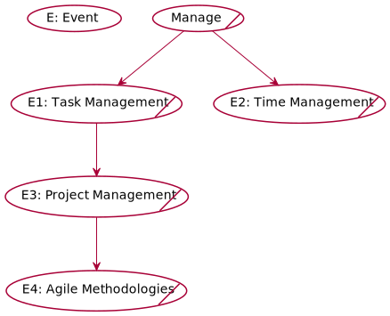

# #Manage

## Table of Contents
- [#Manage](#manage)
  - [Table of Contents](#table-of-contents)
  - [Events](#events)
    - [Project Management](#projectmanagement)
    - [Task Management](#taskmanagment)
    - [Time Management](#timemanagement)
    - [Agile Methodologies](#agilemethodologies)

## Events

### Task Management

Speaker: **#** 

Date: 13/02/2022 

Goals: 

  - how you can manage your Tasks ?

---
### Project Management

Speaker: **#** 

Date: 26/02/2022 

Goals: 

  - What are the tools you can use to manage your project?

---
### Time Management

Speaker: **#** 

Date: 5/03/2022 

Goals: 

  - Time Management.

---
### Agile Methodologies

Speaker: **#** 

Date: 13/03/2022 

Goals: 

  - What are Agile Methodologies?

---

