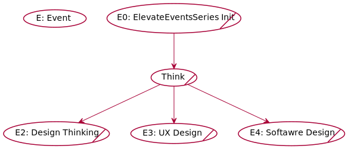

# #Think

## Table of Contents
- [#Think](#think)
  - [Table of Contents](#table-of-contents)
  - [Events](#events)
    - [Design Thinking](#designthinking)
    - [UX Design](#uxdesign)
    - [Software Design](#softwaredesign)

## Events

### Design Thinking 

Speaker: **#** 

Date: 12/02/2022 

Goals: 

  - What is design thinking?
  - How you can use it in your projects?

---
### UX Design 

Speaker: **#** 

Date: 20/02/2022 

Goals: 

  - What is UX?
  - Product design.

---
### Software Design

Speaker: **#** 

Date: 6/03/2022 

Goals: 

  - What is Software design?
  

---

